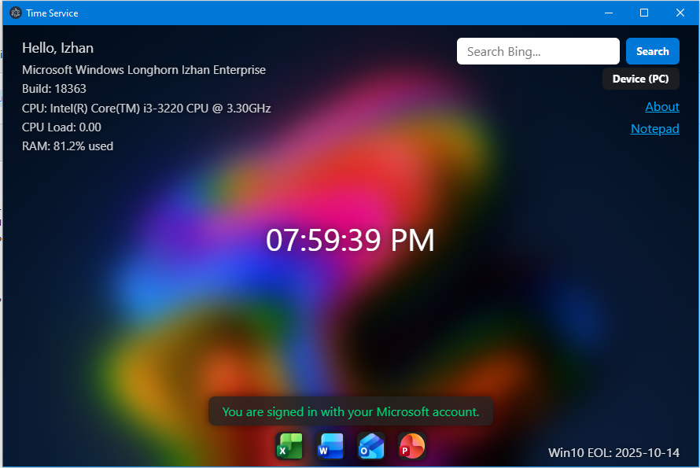

# Time Service

Time Service App is a modern Electron-based utility for Windows.
It displays your local time, Windows version and performance info, and the Windows 10 End of Support date.
You can search Bing, personalize your device type, and enjoy a blurred desktop wallpaper background.

© 2025 Time Service Team

 

THIS APP DOESN'T BELONG TO MICROSOFT OR THIS APP ISN'T MADE BY MICROSOFT

# LICENSE

MIT

